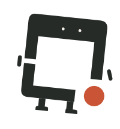

<p align="center">
  <picture>
    <source media="(prefers-color-scheme: dark)" srcset="assets/brand/banner-dark.svg">
    
  </picture>
</p>

<p align="center">
  <b>DeskMind Eyes</b> · Screenshot in, point out: a small GUI grounding model and the recipe that trained it.<br>
  <a href="README.zh-CN.md">中文</a> · <a href="docs/results.md">Results</a> · <a href="docs/training.md">Training</a>
</p>

---

**DeskMind · 得心** — *得心，应手。* (from 得心应手: what the mind decides, the hand carries out) is a family of open-source
projects that let an agent **see** your screen, **decide** the next step, and **act** on the real desktop, all locally.

This repository is the **Eyes**. Give it a screenshot and a short description of a UI element ("reload CMake cache",
"the send button"); it returns the point to click. It contains:
- the training code (SFT and GRPO-style RL with a 0/1 in-box reward);
- the evaluation harness for ScreenSpot v1 / v2 / Pro and UI-Vision;
- a local grounding server;
- summary tables of every eval run we report.

| | Repository | Role |
|---|---|---|
| 👁 | **deskmind-ai/eyes** | find the target on a screenshot |
| 🧠 | [deskmind-ai/brain](https://github.com/deskmind-ai/brain) | decide the next step, with calibrated confidence |
| ✋ | [deskmind-ai/hands](https://github.com/deskmind-ai/hands) | drive the real macOS desktop |
| 📐 | [deskmind-ai/bench](https://github.com/deskmind-ai/bench) | sandbox desktop tasks and graders to reproduce our numbers |

## What it does

- **One question, one point.** Input is a screenshot plus an instruction. Output is a point in 0–1000 relative
  coordinates, either as `{"point_2d": [x, y]}` or as a `computer_use` tool call. A hit means the point lands inside
  the target's box.
- **Small model, RL on the pool.** Eyes-4B is GUI-Owl-1.5-4B-Instruct plus a LoRA trained with RL. The rounds that
  helped all did one thing: they fed the model questions it only sometimes gets right (see
  [docs/training.md](docs/training.md)).
- **Local serving.** `deskmind_eyes.ground_server` runs the model with MLX on Apple Silicon and listens on
  `127.0.0.1` only. A request names a PNG on local disk, so screenshots never leave the machine.
- **Honest evals.** Every comparison is paired sample by sample on the same hardware and inference stack, with
  McNemar's z. Per-run summaries are in [`results/`](results).

## Results (September 2026)

ScreenSpot-Pro, full set (1,581 items). All numbers are our own runs on one setup: a single GPU, vLLM 0.19, bf16,
greedy decoding, native resolution, the Qwen3-VL `computer_use` tool prompt.

| | no zoom (one pass) | zoom 0.5 (two passes) |
|---|---|---|
| GUI-Owl-1.5-4B-Instruct (base) | 64.8 | 76.2 |
| KV-Ground-4B, same setup | 66.1 | – |
| **Eyes-4B** | **67.7** | **77.5** |

- **No zoom** is the headline setting: one forward pass on the full screenshot.
  - Against the base: +2.9 (+81 / −34 items, z = 4.4).
  - Against KV-Ground-4B on the same setup: +1.6 (+68 / −42, z = 2.5).
- **Zoom 0.5** is a second pass: crop half the width and height around the first prediction, then predict again.
  The gain over the base, +1.3 (z = 2.0), is at the edge of what we call significant.
- **Other benchmarks:**
  - ScreenSpot-v2 (1,272 items): 92.8 → 95.0 (z = 4.7). All six text / icon × mobile / desktop / web cells improve.
  - UI-Vision element grounding (5,479 items): 30.7 → 32.5 (z = 5.3), measured on a checkpoint trained without
    GroundCUA. The final model scores 33.1, but GroundCUA and UI-Vision come from the same apps, so we do not count
    that number as clean.

**How this compares.** Other models' published numbers use other harnesses:
- self-reported, no zoom: KV-Ground-4B 67.0, GUI-Owl-1.5-4B 66.8, Qwen-UI-Agent-4B 67.8 (weights not released);
- on our setup, KV-Ground-4B scores 0.9 lower than it reports;
- across GPUs and inference stacks, the same weights move by 0.5–0.9 on Pro.

So we claim only what the paired runs show: on one setup, Eyes-4B beats the two open-weight 4B grounders we could run.
Against Qwen-UI-Agent-4B's self-reported 67.8 we are within noise.

**Known gaps:**
- **Small targets:** on the quarter of targets with the smallest boxes, Eyes-4B hits only 46.1%. KV-Ground is level
  there (46.6) and ahead on Creative-app icons (46.9 vs 44.8).
- **Zoom:** the two-pass gain over the base is small (+1.3).
- **Deployed setting:** the local server runs a 4-bit MLX conversion at ≤2 MP with the `point_2d` prompt. That is not
  the benchmarked setting, and we have no benchmark number for it.

Method, per-category tables and the earlier Qwen3.5-4B runs: [docs/results.md](docs/results.md).

## Quick start

```bash
uv sync --extra mlx                     # Python 3.12; the mlx extra is for Apple Silicon
uv run python -m deskmind_eyes.prepare_data --only screenspot_pro     # downloads and verifies every image
```

**Local grounding server** (Apple Silicon). The Eyes-4B weights are on Hugging Face as
[deskmind/eyes-4b](https://huggingface.co/deskmind/eyes-4b): bf16 on `main`, a 4-bit MLX conversion on the `mlx-4bit`
branch. The repository is private until release; access on request. You can also build the weights from a training run
(see [docs/training.md](docs/training.md)), or point `--model` at any MLX conversion of GUI-Owl-1.5-4B-Instruct to
try the server:

```bash
uv run hf download deskmind/eyes-4b --revision mlx-4bit --local-dir models/eyes-4b-mlx
uv run python -m deskmind_eyes.ground_server --model models/eyes-4b-mlx --port 8010
curl -s localhost:8010/ground -H 'Content-Type: application/json' \
  -d '{"image": "/abs/path/to/screenshot.png", "queries": {"send": "the send message button"}}'
# -> {"points": {"send": [0.97, 0.95]}, "seconds": ...}      relative (0-1) to the image; null if unparsed
```

**Benchmark eval.** On a CUDA GPU with vLLM 0.19, for a merged HF checkpoint:

```bash
uv pip install "vllm==0.19.*"
uv run python -m deskmind_eyes.eval_vllm --model runs/merged/eyes-4b --benchmark screenspot_pro --prompt-style tool
uv run python -m deskmind_eyes.eval_vllm --model runs/merged/eyes-4b --benchmark screenspot_pro --prompt-style tool --zoom 0.5
uv run python -m deskmind_eyes.compare runs/eval/base.jsonl runs/eval/candidate.jsonl      # paired, McNemar
```

On a Mac, `python -m deskmind_eyes.eval_mlx MODEL OUT.jsonl --benchmark screenspot_v2` runs the same protocol with
mlx-vlm (slow at native Pro resolution). `leaderboard/` holds an adapter for the official ScreenSpot-Pro script.

## Training

See [docs/training.md](docs/training.md). It covers:
- the data sources: ShowUI-desktop, [OS-Atlas desktop with rewritten instructions](docs/training.md#data) (see the disclosure there), and GroundCUA;
- difficulty scoring and dynamic sampling;
- the three RL rounds from 64.8 to 67.7;
- what did not work.

## Brand

The frame is your desk. The orange point is where the eyes land. The mascot is **Xiaofang (小方)**, the frame come to
life. Assets are in [`assets/brand`](assets/brand).

<p>
  
</p>

<p>
  
  
  
  
</p>

## License

Code is licensed Apache-2.0. Datasets and base models are downloaded from their sources and keep their own licences;
none are redistributed here. The DeskMind name, 得心, the logo and Xiaofang are not covered by the code licence. You
may use them to refer to the project, but not in modified form or to imply endorsement.
